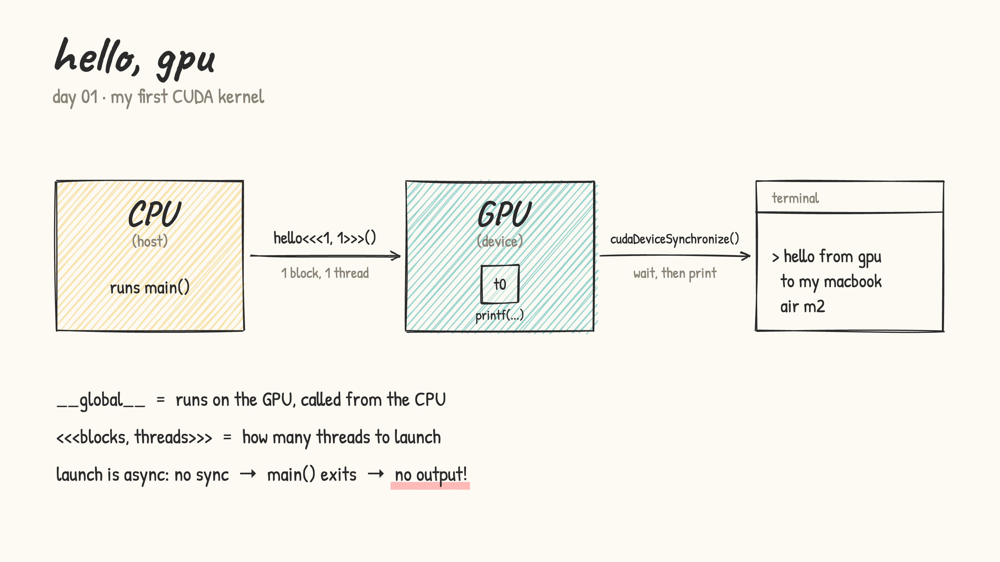
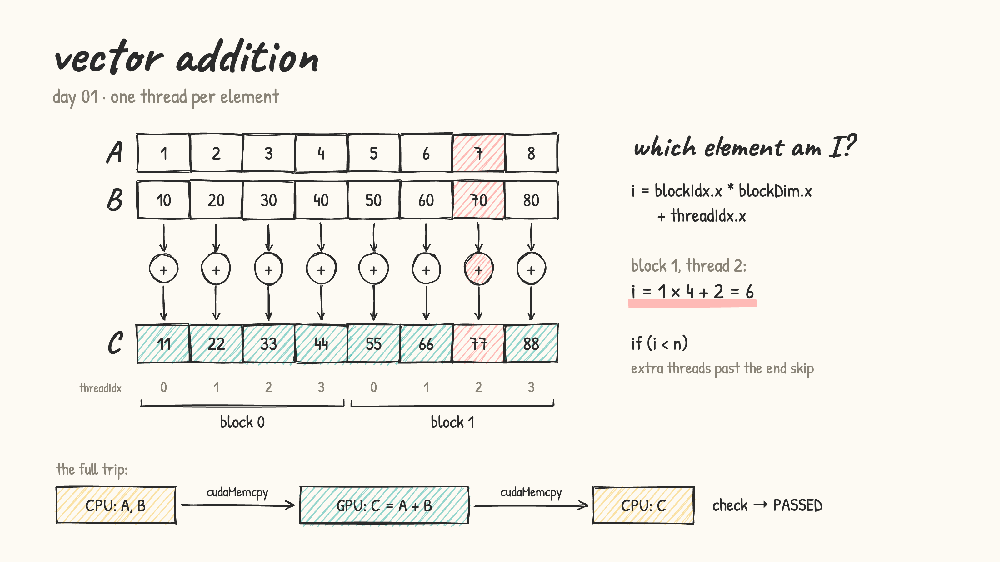

# Learning CUDA

Writing GPU code every day and posting what I learn, with a hand-drawn diagram for each day.

## Progress

### Day 01

- wrote my first two kernels:
  - [hello_world.cu](day01/hello_world.cu)
  - [vector_addition.cu](day01/vector_addition.cu)

- `__global__` marks a function that runs on the GPU and is launched from the CPU. `<<<blocks, threads>>>` says how many threads to launch. Kernel launches are async, so without `cudaDeviceSynchronize()` the program can exit before the GPU's `printf` shows up.

  

- vector addition: one thread per element. Each thread finds its element with `i = blockIdx.x * blockDim.x + threadIdx.x`. The `if (i < n)` check stops the extra threads in the last block from writing past the end. The data goes CPU → GPU with `cudaMemcpy`, gets added on the GPU, then gets copied back.

  

- bugs I hit: `print` → `printf`, plus a missing `;`
