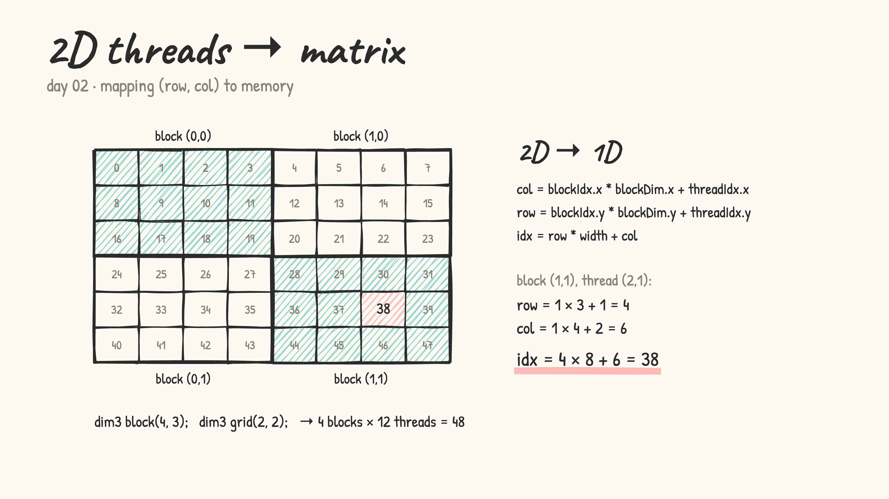
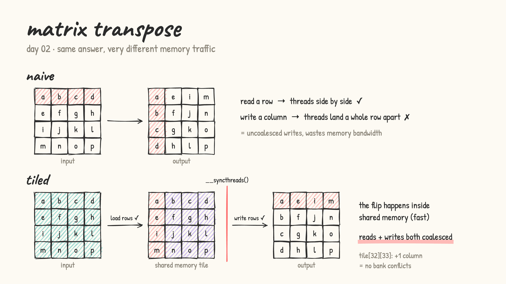

# Day 02: 2D indexing + matrix transpose

- [thread_indexing_2d.cu](thread_indexing_2d.cu): 2D blocks map nicely onto a matrix. `row = blockIdx.y * blockDim.y + threadIdx.y`, `col = blockIdx.x * blockDim.x + threadIdx.x`, `idx = row * width + col`.

  

- [matrix_transpose.cu](matrix_transpose.cu): three versions, timed side by side
  - **naive**: correct, but writes go down a column, so neighbouring threads write a whole row apart (uncoalesced)
  - **tiled**: load a 32×32 tile into shared memory, `__syncthreads()`, write it back flipped. Reads and writes are both coalesced
  - **tiled + padding**: `tile[32][33]` shifts each row onto a different shared-memory bank, so there are no bank conflicts

  

- lesson: GPU speed isn't just less math, it's how threads touch memory
