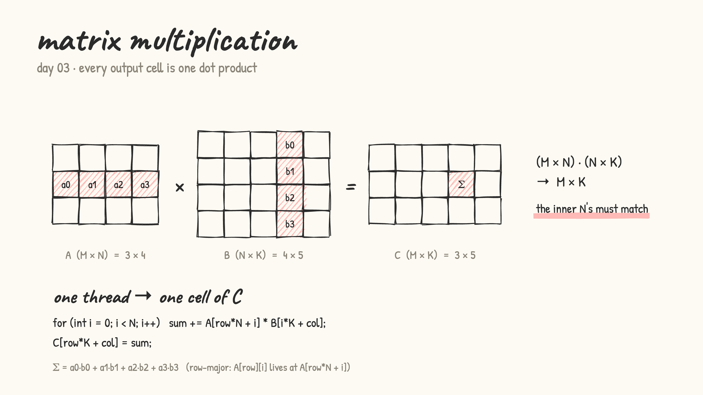
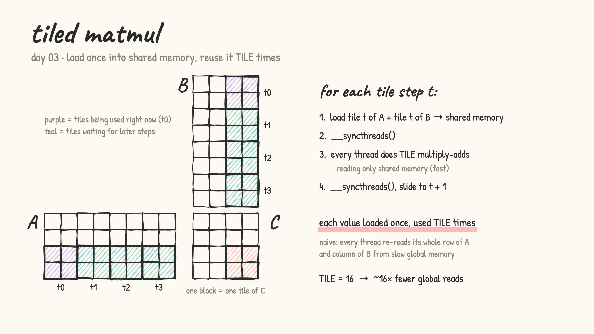

# Day 03: matrix multiplication

- A is M × N, B is N × K, so C = A · B is M × K (the inner N's must match). Every cell of C is the dot product of one row of A and one column of B.

  

- [matmul.cu](matmul.cu): two versions, timed side by side and checked against a CPU result
  - **naive**: one thread per cell of C, 2D indexing for (row, col), a loop over N adds up the products. Works, but neighbouring threads keep re-reading the same values of A and B from global memory
  - **tiled**: each block computes a 16×16 tile of C. It slides along N one tile at a time: load a tile of A and a tile of B into shared memory, `__syncthreads()`, every thread does 16 multiply-adds from shared memory, `__syncthreads()`, next tile. Each value comes from global memory once and gets used 16 times

  

- this is the core op behind neural network layers and LLM inference, so it's worth getting fast
